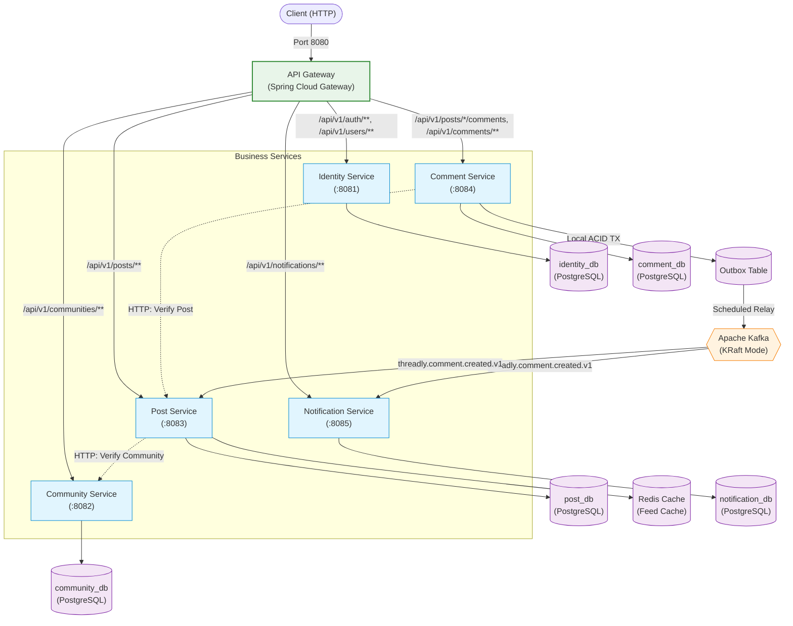
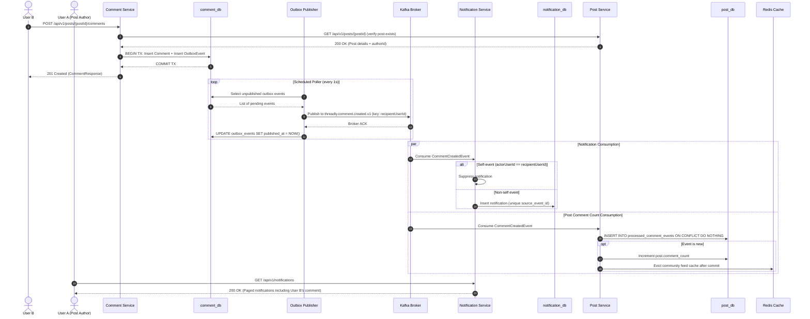

# Threadly

Threadly is a Reddit-style backend built as a Java/Spring Boot microservice system demonstrating service isolation, JWT authentication, PostgreSQL database-per-service, Redis caching, Kafka event messaging, transactional outbox delivery, idempotent consumers, concurrency-safe voting, API Gateway routing, OpenAPI documentation, and Docker Compose deployment.

This project is designed as a portfolio and reference backend demonstrating production-oriented architectural patterns rather than a production-ready deployment.

---

## Overview

Threadly provides a Reddit-like backend platform supporting users, communities, posts, comments, voting, and notifications across six decoupled Spring Boot microservices. It is a backend-only system that exposes REST APIs routed through a centralized Spring Cloud Gateway.

The system combines synchronous HTTP communication for strong invariant validation (such as verifying community existence before post creation) with asynchronous Kafka event messaging for background processing (such as projecting post comment counts and generating user notifications). All services run containerized with isolated persistence via Docker Compose for straightforward local development.

---

## Architecture

The following diagram illustrates the system architecture, synchronous HTTP boundaries, asynchronous Kafka messaging, and strict database-per-service isolation:



Each business service connects exclusively to its own PostgreSQL database. The API Gateway maintains no database and performs pure request routing. Services never query another service's database directly.

---

## Services

| Service | Port | Responsibility | Persistence |
| ------- | ---: | -------------- | ----------- |
| **API Gateway** | 8080 | Single entry point, path routing, and port consolidation | None |
| **Identity Service** | 8081 | User registration, authentication, JWT issuing, opaque refresh token rotation, and profiles | `identity_db` |
| **Community Service** | 8082 | Community lifecycle, descriptions, and user memberships | `community_db` |
| **Post Service** | 8083 | TEXT/LINK post publishing, `new`/`top` feed listings, post voting, and comment count projection | `post_db` + Redis cache |
| **Comment Service** | 8084 | Post comments, direct replies, comment voting, and transactional outbox event publishing | `comment_db` + transactional outbox |
| **Notification Service** | 8085 | In-app user notifications for comments and replies with self-notification suppression | `notification_db` |

---

## Tech Stack

* **Java**: 21
* **Spring Boot**: 4.0.8
* **Spring Cloud**: 2025.1.3 (Spring Cloud Gateway Server WebFlux)
* **Build Tool**: Maven 3.9+
* **Database**: PostgreSQL 18.6
* **Cache**: Redis 8.10.1
* **Event Broker**: Apache Kafka 4.3.1 (KRaft mode)
* **Database Migrations**: Flyway
* **Security**: Spring Security (OAuth2 Resource Server with JWT HMAC-SHA256)
* **Data Access**: Spring Data JPA / Hibernate
* **API Documentation**: springdoc-openapi 3.1.1 (OpenAPI 3 / Swagger UI)
* **Containerization**: Docker & Docker Compose
* **Testing**: JUnit 5, Mockito, Spring Boot Test, Spring Security Test, Spring Kafka Test

---

## Core Capabilities

### Identity
* User registration with BCrypt password hashing.
* Login issuing stateless JWT access tokens (15-minute expiration) and opaque refresh tokens (7-day expiration).
* Single-use refresh token rotation with SHA-256 token hashing in storage.
* Logout endpoint revoking refresh tokens.
* Authenticated current-user profile (`/api/v1/users/me`).

### Communities
* Community creation with automatic creator membership.
* Paginated community listings and individual community retrieval with member counts.
* Community join and leave operations.

### Posts
* Support for `TEXT` and `LINK` post types.
* Post retrieval by ID.
* Paginated feed queries sorted by `new` (chronological) or `top` (score-based).
* Concurrency-safe post upvoting and downvoting.
* Comment count projection maintained asynchronously via Kafka.
* Redis feed caching for default first-page requests.

### Comments
* Root comments on posts and direct replies to comments.
* Hierarchical parent-comment validation ensuring replies belong to the same post.
* Concurrency-safe comment voting.
* Paginated retrieval for root comments and direct replies.

### Notifications
* Automated notification generation for comments on posts and replies to comments.
* Automatic self-notification suppression when users comment on their own posts or replies.
* Paginated notification listing for authenticated users.
* Mark notification as read (`PATCH /api/v1/notifications/{notificationId}/read`).

---

## Important Architectural Patterns

### Database Per Service
Each microservice owns a dedicated PostgreSQL database (`identity_db`, `community_db`, `post_db`, `comment_db`, `notification_db`). Cross-database queries and foreign keys across service boundaries are strictly prohibited. Inter-service data requirements are satisfied via synchronous HTTP APIs or asynchronous Kafka events.

### Transactional Outbox
To guarantee reliable event publication without distributed transactions:
1. When a comment is created, the comment entity and an outbox event row are inserted within the **same local PostgreSQL transaction**.
2. A scheduled poller (`OutboxEventPublisher`) queries unpublished events in batches ordered by creation timestamp.
3. The poller publishes each event to Kafka and awaits broker acknowledgement.
4. Upon successful broker acknowledgement, the outbox row is marked with `published_at = NOW()`.
5. Delivery is **at-least-once**; duplicate delivery can occur if the publisher is interrupted between broker acknowledgement and the database update. Consumers are designed to be idempotent.

### Idempotent Kafka Consumers
Because Kafka delivery is at-least-once, consumers handle duplicates gracefully:
* **Notification Service**: Uses an initial duplicate check against `source_event_id` and relies on a database unique constraint (`uq_notifications_source_event_id`). If a concurrent duplicate insert fails, the exception is caught and the duplicate is safely ignored.
* **Post Service**: Records processed events in a dedicated `processed_comment_events` table using `INSERT ... ON CONFLICT DO NOTHING`. If an event was already processed, the comment count increment and cache eviction are skipped.

### Concurrency-Safe Voting
Post and comment voting are protected against race conditions:
* Votes are acquired using pessimistic row locking (`SELECT ... FOR UPDATE` via `findByIdWithLock`).
* Vote state transitions compute precise score deltas (+1, -1, +2, -2, 0).
* Submitting the same vote value repeatedly is an idempotent no-op.
* Removing a vote reverses the previously cast score delta.

### Redis Cache-Aside
* Post Service caches the default first page (`page=0`, `size=20`) of `new` and `top` community feeds using the key pattern `posts:{communityId}:{sort}:0:20`.
* Cached entries have a 60-second time-to-live (TTL).
* Cache operations fail open: if Redis is unreachable, errors are logged and the request falls back transparently to PostgreSQL.
* Cache entries are invalidated transactionally after commit (`evictAfterCommit`) upon post creation, vote updates, and comment count increments.

### API Gateway
* Spring Cloud Gateway acts as the single reverse proxy and external entry point on port 8080.
* Routes are configured statically to forward requests based on URL path prefixes.
* The Gateway does not issue trusted identity headers; each downstream business service independently verifies and decodes JWT bearer tokens using Spring Security OAuth2 Resource Server.

---

## Comment Event Flow

The diagram below details the end-to-end event flow when a user comments on a post:



---

## API Overview

All external requests pass through the API Gateway at `http://localhost:8080`.

### Authentication & Users
* `POST /api/v1/auth/register` - Register a new user account
* `POST /api/v1/auth/login` - Authenticate and receive access + refresh tokens
* `POST /api/v1/auth/refresh` - Rotate refresh token and receive a new access token
* `POST /api/v1/auth/logout` - Revoke refresh token
* `GET /api/v1/users/me` - Retrieve current authenticated user profile

### Communities
* `POST /api/v1/communities` - Create a community (creator automatically becomes a member)
* `GET /api/v1/communities` - List communities (paginated)
* `GET /api/v1/communities/{communityId}` - Get community details by ID
* `POST /api/v1/communities/{communityId}/join` - Join a community
* `DELETE /api/v1/communities/{communityId}/join` - Leave a community

### Posts
* `POST /api/v1/posts` - Create a new `TEXT` or `LINK` post
* `GET /api/v1/posts` - List posts by community with sorting (`sort=new` or `sort=top`) and pagination
* `GET /api/v1/posts/{postId}` - Get post details by ID
* `PUT /api/v1/posts/{postId}/votes` - Cast or update vote on a post (`{"value": 1}` or `{"value": -1}`)
* `DELETE /api/v1/posts/{postId}/votes` - Remove vote from a post

### Comments
* `POST /api/v1/posts/{postId}/comments` - Create a root comment or a reply (`parentCommentId` optional)
* `GET /api/v1/posts/{postId}/comments` - List root comments for a post (paginated)
* `GET /api/v1/comments/{commentId}/replies` - List direct replies for a comment (paginated)
* `PUT /api/v1/comments/{commentId}/votes` - Cast or update vote on a comment (`{"value": 1}` or `{"value": -1}`)
* `DELETE /api/v1/comments/{commentId}/votes` - Remove vote from a comment

### Notifications
* `GET /api/v1/notifications` - List notifications for current user (paginated)
* `PATCH /api/v1/notifications/{notificationId}/read` - Mark a notification as read

---

## OpenAPI Documentation

Interactive Swagger UI and raw OpenAPI JSON documents are exposed directly by each business service during host development:

| Service | Swagger UI URL | OpenAPI Specification |
| ------- | -------------- | --------------------- |
| Identity Service | `http://localhost:8081/swagger-ui.html` | `http://localhost:8081/v3/api-docs` |
| Community Service | `http://localhost:8082/swagger-ui.html` | `http://localhost:8082/v3/api-docs` |
| Post Service | `http://localhost:8083/swagger-ui.html` | `http://localhost:8083/v3/api-docs` |
| Comment Service | `http://localhost:8084/swagger-ui.html` | `http://localhost:8084/v3/api-docs` |
| Notification Service | `http://localhost:8085/swagger-ui.html` | `http://localhost:8085/v3/api-docs` |

> [!NOTE]
> When running via Docker Compose, service ports 8081-8085 are kept internal to the Docker network for security. The API Gateway routes business APIs on port 8080 and intentionally does not aggregate Swagger UI. To inspect Swagger UI locally, run the services on the host or map service ports.

---

## Local Setup

### Prerequisites
* [Docker](https://docs.docker.com/get-docker/) (v24+)
* [Docker Compose](https://docs.docker.com/compose/) (v2+)

*(Optional for host-based development: Java 21, Maven 3.9+)*

---

## Environment Configuration

1. Copy the example environment file:
   ```bash
   cp .env.example .env
   ```

2. Edit `.env` to configure passwords and secret keys:
   ```dotenv
   # PostgreSQL Configuration
   POSTGRES_PORT=5432
   POSTGRES_USER=threadly
   POSTGRES_PASSWORD=your_secure_postgres_password
   POSTGRES_DB=threadly

   # Redis Configuration
   REDIS_PORT=6379

   # Kafka Configuration
   KAFKA_PORT=9092

   # JWT Configuration (must be at least 32 bytes / 256 bits)
   JWT_SECRET=your_jwt_secret_key_at_least_32_bytes_long_here
   ```

> [!IMPORTANT]
> Always change `POSTGRES_PASSWORD` and `JWT_SECRET` from default placeholders before running.

---

## Running the Complete System

### Start all services
Build images and start all containers in the background:
```bash
docker compose up --build -d
```

### Verify container status
Check that all 9 containers (PostgreSQL, Redis, Kafka, Gateway, and 5 business services) are healthy:
```bash
docker compose ps
```

### Access points
* **Public Gateway**: `http://localhost:8080`
* **Gateway Health Check**: `http://localhost:8080/actuator/health`

### View logs
Follow logs across all containers or for a specific service:
```bash
docker compose logs -f
docker compose logs -f comment-service
```

### Stop the system
Stop containers without losing database or Kafka state:
```bash
docker compose stop
```

### Clean up (Destructive)
> [!CAUTION]
> The `-v` flag removes named Docker volumes (`postgres_data`, `redis_data`, `kafka_data`), permanently deleting all local data:
```bash
docker compose down -v
```

---

## Example API Flow

The following walkthrough demonstrates the complete system flow across two users using `curl` through the API Gateway at `http://localhost:8080`. User B comments on User A's post, triggering the outbox, Kafka event delivery, post comment count update, and a notification for User A.

### 1. Register and Login User A
```bash
# Register User A
curl -s -X POST http://localhost:8080/api/v1/auth/register \
  -H "Content-Type: application/json" \
  -d '{"username":"alice","email":"alice@example.com","password":"Password123!"}'

# Login User A
curl -s -X POST http://localhost:8080/api/v1/auth/login \
  -H "Content-Type: application/json" \
  -d '{"identifier":"alice","password":"Password123!"}'
# Extract accessToken -> <USER_A_ACCESS_TOKEN>
```

### 2. User A Creates a Community
```bash
curl -s -X POST http://localhost:8080/api/v1/communities \
  -H "Content-Type: application/json" \
  -H "Authorization: Bearer <USER_A_ACCESS_TOKEN>" \
  -d '{"name":"technology","displayName":"Technology","description":"All things tech"}'
# Extract community id -> <COMMUNITY_ID>
```

### 3. User A Creates a Post
```bash
curl -s -X POST http://localhost:8080/api/v1/posts \
  -H "Content-Type: application/json" \
  -H "Authorization: Bearer <USER_A_ACCESS_TOKEN>" \
  -d '{
    "communityId":"<COMMUNITY_ID>",
    "title":"Welcome to Threadly",
    "type":"TEXT",
    "content":"This is a distributed microservice discussion platform."
  }'
# Extract post id -> <POST_ID>
```

### 4. Register and Login User B
```bash
# Register User B
curl -s -X POST http://localhost:8080/api/v1/auth/register \
  -H "Content-Type: application/json" \
  -d '{"username":"bob","email":"bob@example.com","password":"Password123!"}'

# Login User B
curl -s -X POST http://localhost:8080/api/v1/auth/login \
  -H "Content-Type: application/json" \
  -d '{"identifier":"bob","password":"Password123!"}'
# Extract accessToken -> <USER_B_ACCESS_TOKEN>
```

### 5. User B Comments on User A's Post
```bash
curl -s -X POST http://localhost:8080/api/v1/posts/<POST_ID>/comments \
  -H "Content-Type: application/json" \
  -H "Authorization: Bearer <USER_B_ACCESS_TOKEN>" \
  -d '{"content":"Great architecture demonstration!"}'
```

### 6. User A Lists Notifications
Wait 1-2 seconds for Kafka asynchronous delivery, then query User A's notifications:
```bash
curl -s -X GET "http://localhost:8080/api/v1/notifications?page=0&size=20" \
  -H "Authorization: Bearer <USER_A_ACCESS_TOKEN>"
```

---

## Testing

The project includes unit, web slice, integration, concurrency, and contract tests across all services.

### Running all tests
```bash
mvn clean verify
```

### Verified Test Snapshot
Latest documented verification: **365 tests passed** with 0 failures, 0 errors, and 0 skipped.

### Test Categories
* **Web Layer & Security**: Controller tests verifying endpoint mappings, validation rules, and Spring Security JWT filters using `@WebMvcTest`.
* **Business Services**: Unit tests verifying domain logic, state machines, and error conditions using Mockito.
* **Database Integration**: Integration tests running Flyway migrations and validating JPA queries, constraints, and transactions against real PostgreSQL databases.
* **Concurrency**: Multi-threaded concurrency tests verifying pessimistic row locking on voting and atomic refresh token rotation.
* **Redis Caching**: Tests asserting cache hits, cache misses, serialization, fail-open behavior, and post-commit cache eviction.
* **Event Messaging**: Kafka integration tests verifying event publishing, outbox polling loops, and consumer idempotency using `@EmbeddedKafka`.
* **API Gateway**: Route configuration and path predicate tests with Spring Cloud Gateway WebFlux.
* **OpenAPI Documentation**: Contract tests verifying OpenAPI 3 documentation generation across all services.

---

## Project Structure

```text
threadly/
├── api-gateway/            # Spring Cloud Gateway (port 8080)
├── identity-service/       # Auth, JWT, user accounts (port 8081)
├── community-service/      # Communities and memberships (port 8082)
├── post-service/           # Posts, feeds, voting, Redis cache (port 8083)
├── comment-service/        # Comments, replies, voting, outbox (port 8084)
├── notification-service/   # Notifications, Kafka consumer (port 8085)
├── docker/                 # Database initialization scripts
├── docs/                   # Detailed architecture documentation
│   └── ARCHITECTURE.md
├── docker-compose.yml      # Multi-container orchestration
├── Dockerfile              # Multi-stage container build
└── pom.xml                 # Maven parent aggregator POM
```

---

## Database Migrations

* Each microservice maintains its own Flyway migrations under `src/main/resources/db/migration/`.
* Hibernate DDL generation is disabled in favor of strict migration validation:
  ```yaml
  spring:
    jpa:
      hibernate:
        ddl-auto: validate
    flyway:
      enabled: true
  ```
* Schema changes are versioned sequentially (`V1__...sql`, `V2__...sql`) and run automatically on service startup.

---

## Consistency and Delivery Semantics

Threadly implements an eventually consistent distributed architecture:
* **Synchronous Precondition Checks**: Services use HTTP calls to enforce hard invariants across boundaries (e.g., Post Service verifies community existence; Comment Service verifies post existence).
* **Local ACID Transactions**: All updates within a service (e.g., saving a comment and writing an outbox event) occur within a single database transaction.
* **No Distributed Transactions**: Threadly avoids distributed two-phase commit (2PC) or XA transactions to prevent cross-service lock contention and tight coupling.
* **Eventual Consistency**: Secondary projections (post comment count and user notifications) are updated asynchronously via Kafka.
* **At-Least-Once Delivery**: The outbox relay re-polls unpublished rows on failure, guaranteeing delivery but occasionally producing duplicates.
* **Consumer Idempotency**: All consumers deduplicate events via primary key or unique constraint checks before applying business state changes.

---

## Failure Behavior

* **Redis Outage**: If Redis becomes unreachable, `PostFeedCache` logs a warning, fails open, and falls back directly to PostgreSQL queries. Feed listings remain available.
* **Kafka Outage**: If the Kafka broker becomes unavailable, comment creation continues to succeed because the comment and outbox event are saved locally to PostgreSQL. The background relay retries unpublished events once Kafka recovers.
* **Outbox Poller Crash**: If the outbox relay crashes after publishing to Kafka but before updating `published_at`, the event is republished upon restart. Downstream idempotent consumers prevent duplicate notifications or comment count increments.
* **Downstream Service Outage**: If Notification Service is down, Kafka retains unacknowledged messages according to topic retention. Once Notification Service restarts, it resumes consuming from its committed offset.

---

## Design Scope

To maintain clarity and architectural focus, Threadly intentionally limits V1 scope:
* **No Service Discovery / Eureka**: Static Docker networking and gateway routes are used for predictability.
* **No Distributed Config Server**: Configuration is managed via standard Spring profiles and environment variables.
* **No Full-Text Search Engine**: Search engines such as Elasticsearch are omitted; queries rely on indexed PostgreSQL columns.
* **No WebSockets / Real-Time Chat**: Notifications are retrieved via polling REST endpoints.
* **No Media File Storage**: Posts support URLs and text content; binary object storage (e.g., S3/MinIO) is omitted.
* **No Distributed Sagas / CQRS**: Read-side projections are limited to comment counts and feed caches.

---

## Security Notes

* **Password Hashing**: User passwords are encrypted using BCrypt.
* **Stateless Authentication**: Access tokens are signed using HMAC-SHA256 with a shared secret (`JWT_SECRET`).
* **Refresh Token Security**: Refresh tokens are random 32-byte values, hashed with SHA-256 before storage, and rotated on every use.
* **Decentralized Authorization**: Each business service validates JWTs locally without making authorization calls back to Identity Service.
* **Network Isolation**: When deployed with Docker Compose, business services (ports 8081-8085) are not exposed to the host machine. All external traffic must pass through the API Gateway (port 8080).

---

## Architecture Documentation

For a technical dive into inter-service dependencies, transactional boundaries, Kafka delivery guarantees, and concurrency design, see [docs/ARCHITECTURE.md](docs/ARCHITECTURE.md).
