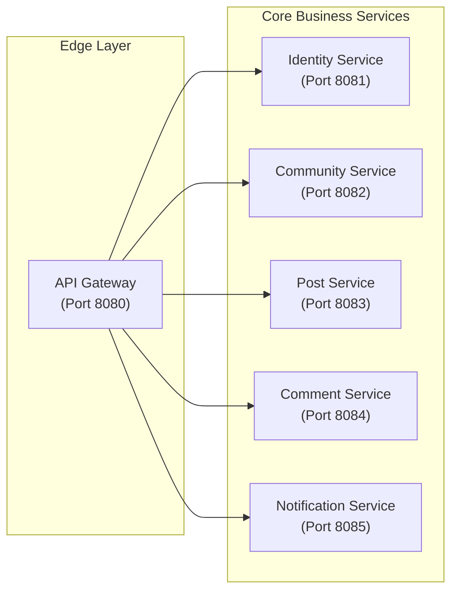
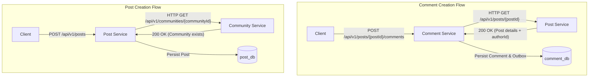
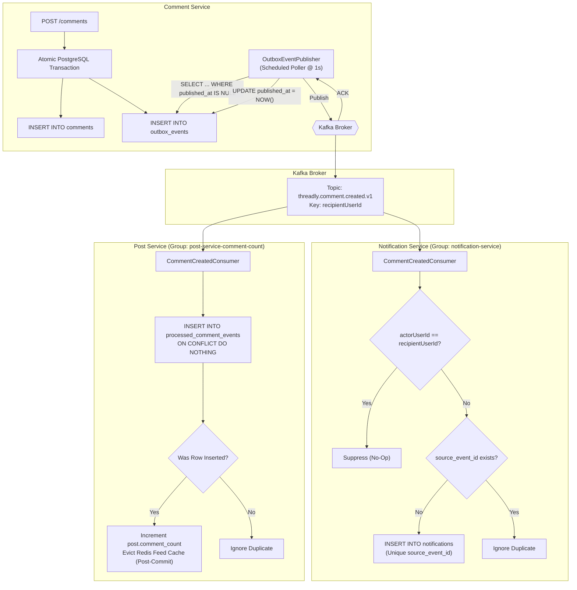
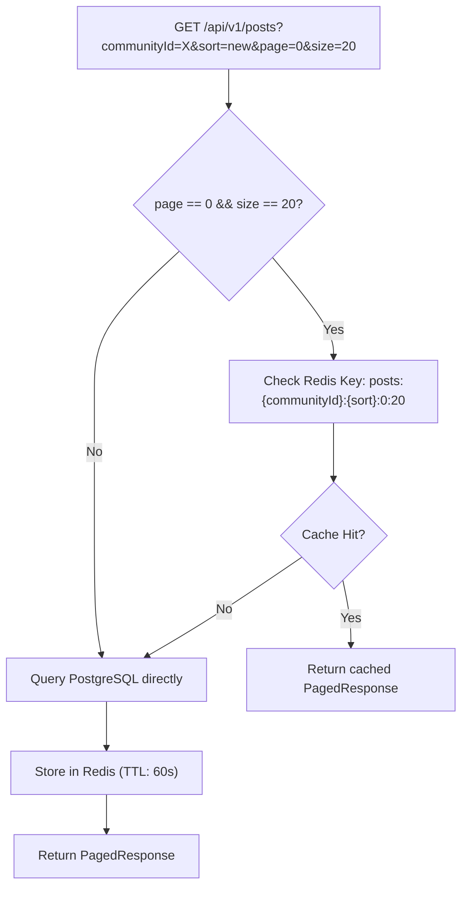
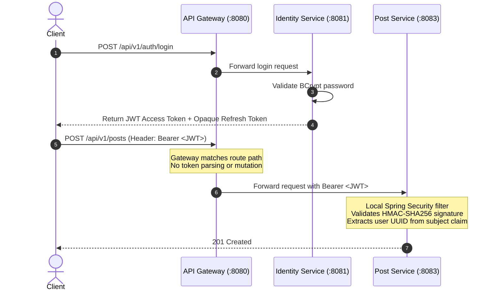

# Threadly Architecture Documentation

This document provides a technical deep dive into the architecture, design decisions, data consistency models, concurrency controls, and operational patterns implemented in Threadly.

---

## 1. System Boundaries & Service Responsibilities

Threadly decomposes a Reddit-style social discussion platform into six isolated Spring Boot microservices. Each service encapsulates a distinct business capability and strictly owns its domain logic and data storage.



### Service Boundaries

| Service | Bounded Context | Invariants & Business Logic | Primary Persistence |
| ------- | --------------- | --------------------------- | ------------------- |
| **API Gateway** | Edge Routing | Unified ingress, URL routing, CORS/request forwarding | None |
| **Identity Service** | Identity & Access | User accounts, password hashing, JWT minting, refresh token rotation | `identity_db` (PostgreSQL) |
| **Community Service** | Communities & Memberships | Community name uniqueness, membership tracking, creator auto-membership | `community_db` (PostgreSQL) |
| **Post Service** | Posts & Feed Queries | TEXT/LINK validation, score tracking, feed sorting (`new`, `top`), commentCount projection | `post_db` (PostgreSQL) + Redis |
| **Comment Service** | Comments & Replies | Nested replies, post affiliation validation, comment score tracking, outbox publishing | `comment_db` (PostgreSQL) |
| **Notification Service** | Notifications | In-app alerts, self-notification suppression, read/unread states | `notification_db` (PostgreSQL) |

---

## 2. Synchronous Inter-Service Communication

While asynchronous event messaging handles background side effects, Threadly uses synchronous HTTP calls via `RestClient` when a hard invariant must be validated before persisting domain entities.



### Synchronous Dependencies
1. **Post Creation Precondition (`Post Service -> Community Service`)**:
   - Before a post is created, `CommunityClient` queries `GET /api/v1/communities/{communityId}`.
   - If the community does not exist (HTTP 404), the request is aborted with `CommunityNotFoundException` before saving to `post_db`.
   - Client timeouts: 3000ms connect timeout, 5000ms read timeout.
2. **Comment Creation Precondition (`Comment Service -> Post Service`)**:
   - Before a comment is created, `PostClient` queries `GET /api/v1/posts/{postId}`.
   - This validates that the post exists and retrieves the post author's `authorId`. The `authorId` is required to determine the notification recipient when commenting on a top-level post.
   - Client timeouts: 3000ms connect timeout, 5000ms read timeout.

---

## 3. Asynchronous Event-Driven Architecture

Threadly avoids distributed transactions across service boundaries by employing the **Transactional Outbox Pattern** paired with **Idempotent Consumers**.



### Transactional Outbox Implementation
* **Atomicity**: In `CommentService.createComment()`, the comment row and the outbox event row are inserted within a single Spring `TransactionTemplate` block. If either insert fails, the entire transaction rolls back.
* **Non-Transactional Polling**: The poller (`OutboxEventPublisher`) runs on a `@Scheduled(fixedDelay = 1000ms)` cycle and is intentionally **not** `@Transactional`. This ensures that database connections are released immediately and not held open during remote Kafka network I/O.
* **Batching**: The poller reads unpublished events in batches of 50 (`outbox.batch-size: 50`) ordered by creation timestamp (`created_at ASC`).
* **Acknowledgement**: Each event is sent to Kafka using `kafkaTemplate.send(...).get(5000, TimeUnit.MILLISECONDS)`. Only after the Kafka broker returns an acknowledgement is the outbox row updated with `published_at = Instant.now()`.
* **Failure Handling**: If Kafka publishing times out or fails, the batch halts immediately. The failed event and subsequent events remain unpublished and will be retried on the next scheduled cycle.

### Kafka Event Delivery & Consumer Semantics

#### Topic & Message Structure
* **Topic**: `threadly.comment.created.v1`
* **Event Message Key**: `recipientUserId.toString()` (the recipient user ID).
* **Payload**: JSON serialization of `CommentCreatedEvent` containing:
  - `eventId` (UUID)
  - `commentId` (UUID)
  - `postId` (UUID)
  - `parentCommentId` (UUID, nullable)
  - `actorUserId` (UUID)
  - `recipientUserId` (UUID)
  - `type` (`POST_COMMENT` or `COMMENT_REPLY`)
  - `createdAt` (ISO-8601 Instant)

#### Configured Local Environment
* In local Docker Compose deployment, Kafka is configured with `KAFKA_NUM_PARTITIONS: 1` in KRaft mode.

#### Delivery Guarantees: At-Least-Once
Delivery from the outbox relay to Kafka is **at-least-once**:
1. If the outbox relay successfully publishes an event to Kafka but the subsequent database update (`UPDATE outbox_events SET published_at = NOW()`) fails or the application crashes, the event remains with `published_at IS NULL`.
2. On the next cycle, the event will be re-sent to Kafka, producing a duplicate message on the topic.
3. Therefore, downstream consumers must never assume exactly-once delivery; both consumers implement robust idempotency.

#### Consumer Idempotency Mechanisms
1. **Notification Service** (`group-id: notification-service`):
   - **Self-Notification Suppression**: If `event.actorUserId().equals(event.recipientUserId())`, the event is immediately discarded. (A user commenting on their own post or replying to their own comment does not generate a notification).
   - **Pre-Check**: Checks `notificationRepository.existsBySourceEventId(event.eventId())` before attempting persistence.
   - **Constraint Enforcement**: The `notifications` table maintains a database-level unique constraint on `source_event_id`. If a concurrent duplicate occurs, `DataIntegrityViolationException` is caught, the duplicate is verified, and the operation safely finishes without error.
2. **Post Service** (`group-id: post-service-comment-count`):
   - **Deduplication Table**: Post Service maintains a dedicated `processed_comment_events` table with `event_id` as the primary key.
   - **Atomic Insertion**: Uses a native SQL query:
     ```sql
     INSERT INTO processed_comment_events (event_id, post_id, processed_at)
     VALUES (:eventId, :postId, :processedAt)
     ON CONFLICT (event_id) DO NOTHING
     ```
   - **Conditional Update**: Only if the row insertion count is 1 (meaning the event is new) does the service execute `postRepository.incrementCommentCount(postId)` and invalidate the Redis feed cache. If the row count is 0, the event is recognized as a duplicate and ignored.

---

## 4. Concurrency Model: Voting

Voting on posts and comments represents a classic write contention problem where concurrent votes on the same item can lead to lost updates or incorrect aggregate scores.

```mermaid
sequenceDiagram
    autonumber
    actor User1 as Concurrent User 1
    actor User2 as Concurrent User 2
    participant DB as post_db (PostgreSQL)

    User1->>DB: BEGIN TX 1
    User2->>DB: BEGIN TX 2

    User1->>DB: SELECT * FROM posts WHERE id = :id FOR UPDATE
    Note over DB: Lock acquired by TX 1
    User2->>DB: SELECT * FROM posts WHERE id = :id FOR UPDATE
    Note over DB: TX 2 blocks waiting for TX 1 lock

    User1->>DB: Check existing vote (None -> +1)
    User1->>DB: INSERT INTO post_votes (post_id, user_id, value = 1)
    User1->>DB: UPDATE posts SET score = score + 1
    User1->>DB: COMMIT TX 1
    Note over DB: Lock released; TX 2 acquires lock

    User2->>DB: Check existing vote (None -> -1)
    User2->>DB: INSERT INTO post_votes (post_id, user_id, value = -1)
    User2->>DB: UPDATE posts SET score = score - 1
    User2->>DB: COMMIT TX 2
```

### Concurrency Mechanism
* **Pessimistic Locking**: `postRepository.findByIdWithLock(postId)` and `commentRepository.findByIdWithLock(commentId)` use `@Lock(LockModeType.PESSIMISTIC_WRITE)` (`SELECT ... FOR UPDATE`). Concurrent vote transactions on the same post or comment serialize at the row level.
* **Deterministic Delta Calculation**:
  - **No prior vote**:
    - Upvote (+1): delta = +1
    - Downvote (-1): delta = -1
  - **Prior vote exists**:
    - Same value (e.g., upvote when already upvoted): delta = 0 (idempotent no-op; returns current score immediately without writing).
    - Vote switch (+1 to -1): delta = -2
    - Vote switch (-1 to +1): delta = +2
  - **Vote removal**:
    - Remove upvote: delta = -1
    - Remove downvote: delta = +1
* **Composite Primary Key**: `post_votes` uses `(post_id, user_id)` as the primary key; `comment_votes` uses `(comment_id, user_id)`. A user can have at most one active vote per target entity.

---

## 5. Caching Architecture: Redis Cache-Aside

Post Service implements a cache-aside strategy using Redis to reduce load on PostgreSQL for high-frequency feed reads.



### Cache Design
* **Cache Scope**: Only the default first page (`page=0`, `size=20`) of `new` and `top` feeds is cached. Arbitrary page numbers or non-standard page sizes bypass the cache to preserve Redis memory.
* **Key Format**: `posts:{communityId}:{sort}:0:20` (e.g., `posts:3fa85f64-5717-4562-b3fc-2c963f66afa6:new:0:20`).
* **Time-to-Live (TTL)**: 60 seconds (`cache.feed.ttl-seconds: 60`).
* **Fail-Open Resilience**: All Redis calls in `PostFeedCache` are wrapped in try-catch blocks handling `DataAccessException` and `JacksonException`. If Redis is unavailable or deserialization fails, the error is logged as a warning, and the request falls back seamlessly to PostgreSQL.
* **Transactional Invalidation**: When a post is created, a vote is recorded, or a comment count is incremented:
  - Eviction is registered via `TransactionSynchronizationManager.registerSynchronization`.
  - The cache keys for both `new` and `top` are deleted in the `afterCommit()` lifecycle phase. This prevents race conditions where an evicted cache key is repopulated with stale data while the database transaction is still committing.

---

## 6. Security Architecture: Decentralized JWT Authentication

Threadly adopts a decentralized token validation model across all microservices.



### Key Security Principles
1. **No Gateway Token Decryption**: The API Gateway functions as a pure reverse proxy. It does not terminate authentication or inject mutable "trusted identity headers" (e.g., `X-User-Id`), which could be spoofed if internal network boundaries were breached.
2. **Local JWT Verification**: Every business service includes `spring-boot-starter-security-oauth2-resource-server` and configures a `JwtDecoder` using the shared `JWT_SECRET`. Services decode and validate tokens locally with zero network overhead.
3. **Opaque Refresh Tokens with Single-Use Rotation**:
   - Refresh tokens are cryptographically secure 32-byte random values.
   - They are hashed using **SHA-256** before storage in `identity_db.refresh_tokens`. Raw tokens are never persisted.
   - When refreshed, the existing token is fetched with `SELECT ... FOR UPDATE`, immediately revoked, and a new refresh token + access token pair is issued. Any reuse of an old token is rejected.

---

## 7. Data Isolation & Database-Per-Service

Threadly adheres strictly to the **Database-per-Service** pattern:
* Each microservice connects exclusively to its own database: `identity_db`, `community_db`, `post_db`, `comment_db`, `notification_db`.
* No foreign keys span across databases.
* No service has read or write credentials to another service's database.
* All schema evolution is governed by Flyway migration scripts located within each service's source repository (`src/main/resources/db/migration`). Hibernate DDL generation is disabled (`ddl-auto: validate`).

---

## 8. Architectural Tradeoffs & Decision Records (ADRs)

### ADR 1: Scheduled Outbox Poller vs Change Data Capture (CDC / Debezium)
* **Decision**: Implement a lightweight scheduled poller (`OutboxEventPublisher`) querying `outbox_events WHERE published_at IS NULL`.
* **Rationale**: CDC via Debezium and Kafka Connect requires external infrastructure components, Kafka Connect worker clusters, and PostgreSQL replication slot configuration. For a reference/portfolio system, an in-application poller provides a fully testable outbox mechanism with minimal operational complexity.
* **Tradeoff**: Polling introduces a 1-second delay (`outbox.poll-delay-ms: 1000`) and slight database read overhead compared to real-time WAL streaming.

### ADR 2: Synchronous HTTP Preconditions vs Pure Event Choreography
* **Decision**: Use synchronous HTTP calls (`CommunityClient`, `PostClient`) for creation preconditions, while using Kafka for side effects.
* **Rationale**: Validating that a community exists before creating a post, or that a post exists before creating a comment, is an immediate business invariant. Using eventual consistency for preconditions would require complex compensating sagas (e.g., creating a post, finding the community doesn't exist, and subsequently deleting the post).
* **Tradeoff**: Introduces a runtime coupling between Post Service -> Community Service and Comment Service -> Post Service during write operations.

### ADR 3: Decentralized JWT Validation vs Centralized Gateway Auth Filter
* **Decision**: Validate JWTs independently in each downstream service rather than at the Gateway.
* **Rationale**: Eliminates a single point of failure in security evaluation, avoids trusting internal network headers, and allows each service to enforce granular security rules (such as specific public actuator endpoints or Swagger paths).
* **Tradeoff**: Requires all business services to share the JWT verification key (`JWT_SECRET`).
